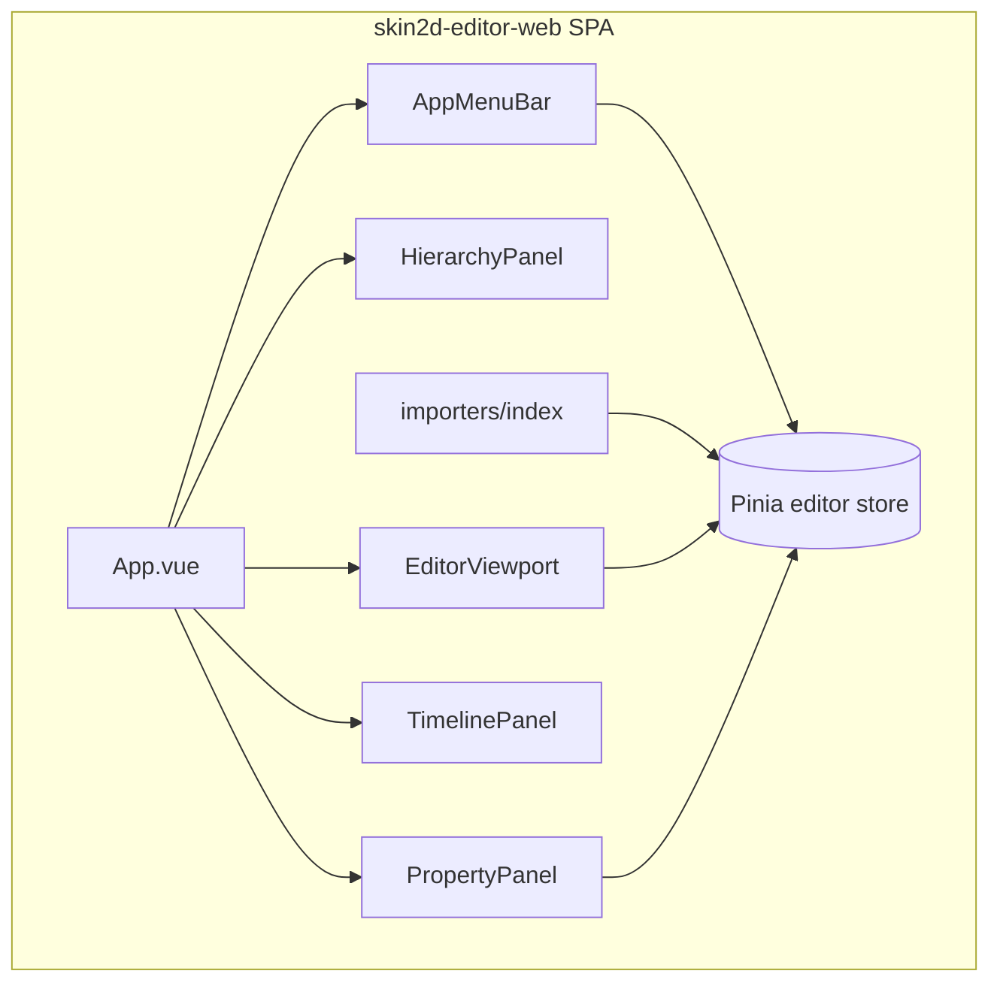

# 组件图（Mermaid）

```mermaid
flowchart TB
  subgraph spa [skin2d-editor-web SPA]
    App[App.vue]
    Menu[AppMenuBar]
    Tree[HierarchyPanel]
    View[EditorViewport]
    Prop[PropertyPanel]
    Time[TimelinePanel]
    Store[(Pinia editor store)]
    Imp[importers/index]
  end
  App --> Menu
  App --> Tree
  App --> View
  App --> Prop
  App --> Time
  Menu --> Store
  Imp --> Store
  View --> Store
  Prop --> Store
```
